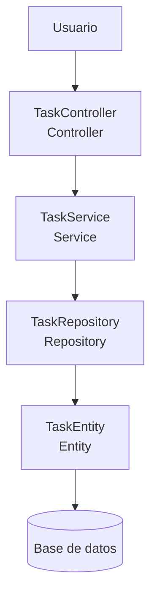

# Arquitectura en capas - Task Manager

## 1. Caso seleccionado

El caso seleccionado es un sistema de gestión de tareas (Task Manager). La API permite consultar y gestionar las tareas mediante una arquitectura organizada en diferentes capas.

## 2. Diagrama de la API

## 3. Responsabilidad de cada capa

### Controller

El Controller recibe las solicitudes HTTP realizadas por el usuario y las dirige hacia la capa Service. También se encarga de devolver la respuesta correspondiente.

### Service

El Service contiene la lógica de negocio de la aplicación. Recibe las solicitudes del Controller y determina las operaciones que se deben realizar.

### Repository

El Repository se encarga del acceso a los datos. Realiza las operaciones necesarias para consultar o modificar la información almacenada.

### Entity

La Entity representa la estructura de los datos de una tarea. Una tarea puede contener información como identificador, título, descripción, estado y fecha de creación.

## 4. Endpoint de ejemplo

### GET /tasks

Este endpoint permite consultar las tareas registradas.

El flujo de la solicitud es:

**Usuario → TaskController → TaskService → TaskRepository → TaskEntity → Base de datos**

Primero, el usuario realiza la solicitud `GET /tasks`. El Controller recibe la petición y la envía al Service. Luego, el Service solicita al Repository la información de las tareas. El Repository accede a los datos y obtiene la información de la base de datos. Finalmente, la respuesta regresa al usuario a través del Controller.
