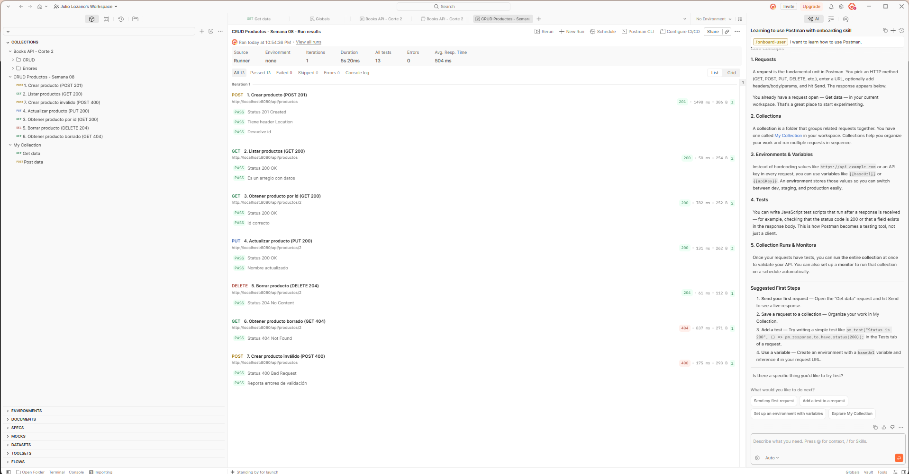

# Semana 08 · CRUD REST — Productos

Actividad práctica de **Desarrollo Fullstack** (CORHUILA, 2026-B).
CRUD REST de un recurso `Producto` con arquitectura por capas en **Spring Boot 3 + Java 17 + H2**.

**Autor:** Julio Cesar Lozano · GitHub: Lozano-027

## Arquitectura por capas

```
controller/  -> ProductoController   (HTTP: rutas, códigos de estado)
service/     -> ProductoService      (lógica de negocio)
repository/  -> ProductoRepository   (acceso a datos, JpaRepository)
entity/      -> Producto             (modelo JPA + validaciones)
exception/   -> manejo global de errores (404 / 400)
```

El controller solo habla con el service, y el service solo habla con el repository.

## Endpoints

| Acción     | Método | URL                    | Respuesta OK | Errores |
|------------|--------|------------------------|--------------|---------|
| Crear      | POST   | `/api/productos`       | 201 Created + `Location` | 400 |
| Listar     | GET    | `/api/productos`       | 200 OK       | — |
| Obtener    | GET    | `/api/productos/{id}`  | 200 OK       | 404 |
| Actualizar | PUT    | `/api/productos/{id}`  | 200 OK       | 400, 404 |
| Borrar     | DELETE | `/api/productos/{id}`  | 204 No Content | 404 |

URLs con **sustantivos en plural** y el verbo lo da el **método HTTP**.

### Ejemplo de cuerpo JSON
```json
{ "nombre": "Mouse", "descripcion": "Mouse inalámbrico", "precio": 45000, "stock": 25 }
```

## Cómo ejecutar

Requisitos: JDK 17+ y Maven (o la extensión de Java de tu editor).

```bash
mvn spring-boot:run
```

- API: http://localhost:8080/api/productos
- Consola H2: http://localhost:8080/h2-console (JDBC URL `jdbc:h2:mem:productosdb`, usuario `sa`, sin clave)

## Pruebas

**1. Tests automáticos (extremo a extremo con MockMvc):**
```bash
mvn test
```
Cubre crear (201), validación (400), listar, obtener, actualizar (200), borrar (204) y 404.

**2. Pruebas manuales:**
- `requests.http` → ábrelo con la extensión *REST Client* y pulsa "Send Request".
- `pruebas-curl.sh` → con la app corriendo, genera `evidencias/resultado-curl.txt`.
- También puedes usar Postman o Thunder Client.

## Evidencias

### Postman: ejecución de la colección (13/13 pruebas aprobadas)



Se ejecutaron las 7 peticiones en orden: crear (201), listar (200), obtener (200), actualizar (200), borrar (204), obtener borrado (404) y crear inválido (400).

### Otros archivos

- [Resultado de las pruebas con curl](evidencias/resultado-curl.txt)
- [Colección de Postman para reproducir las pruebas](evidencias/CRUD-Productos.postman_collection.json)