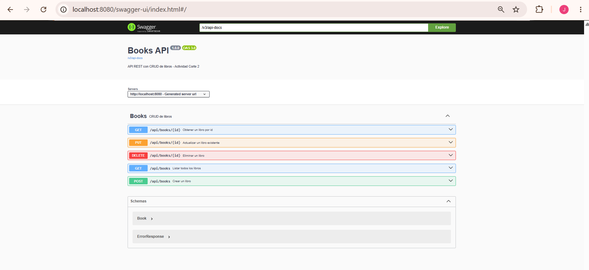
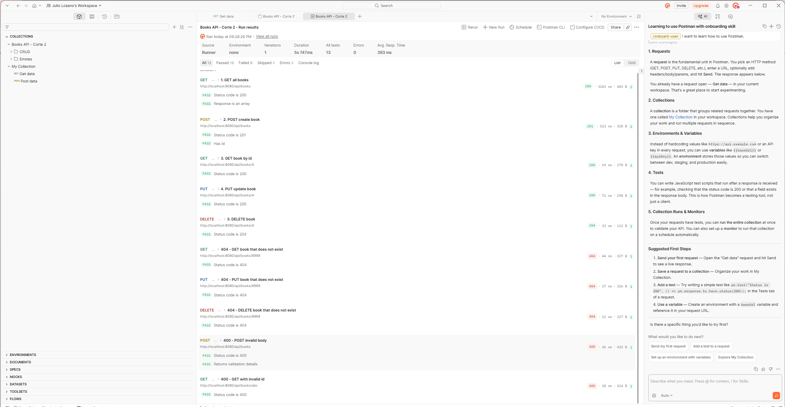

# Books API — API REST con Spring Boot (Corte 2)

API REST para gestionar un catálogo de **libros**, construida con Spring Boot y arquitectura en capas
(entity → repository → service → controller), persistencia con JPA (H2 en memoria),
documentación con Swagger (springdoc-openapi) y pruebas con Postman.

**Autor:** Julio Cesar Lozano · **GitHub:** Lozano-027

## Tecnologías

- Java 17
- Spring Boot 3.3 (Web, Data JPA, Validation)
- H2 Database (en memoria)
- springdoc-openapi 2.6 (Swagger UI)
- Maven (incluye Maven Wrapper)
- Postman

## Estructura del proyecto

```
src/main/java/com/example/books
├── BooksApplication.java          # Clase principal
├── entity/Book.java               # Entidad JPA + validaciones
├── repository/BookRepository.java # Acceso a datos (JpaRepository)
├── service/BookService.java       # Lógica de negocio
├── controller/BookController.java # Endpoints REST
└── exception/                     # Manejo global de errores (400 / 404)
src/main/resources
├── application.properties         # Configuración (H2, JPA, Swagger)
└── data.sql                       # Datos iniciales (3 libros)
postman/books-api.postman_collection.json
```

## Cómo ejecutar

Requisitos: **JDK 17+**. No es necesario tener Maven instalado, porque el proyecto incluye Maven Wrapper (`mvnw`).

```bash
# 1. Ubicarse en la carpeta del proyecto
cd 03-api-rest-books

# 2. Ejecutar la aplicación
.\mvnw spring-boot:run        # Windows (PowerShell)
./mvnw spring-boot:run        # Linux / macOS / Git Bash

# Si tienes Maven instalado también funciona:
mvn spring-boot:run

# (Opcional) compilar y correr el JAR
.\mvnw clean package
java -jar target/api-rest-books-1.0.0.jar
```

La API queda disponible en `http://localhost:8080`.

| Recurso      | URL                                         |
|--------------|---------------------------------------------|
| API          | http://localhost:8080/api/books             |
| Swagger UI   | http://localhost:8080/swagger-ui.html       |
| OpenAPI JSON | http://localhost:8080/v3/api-docs           |
| Consola H2   | http://localhost:8080/h2-console (JDBC URL: `jdbc:h2:mem:booksdb`, usuario `sa`, sin contraseña) |

> La base de datos es en memoria: se reinicia cada vez que se detiene la aplicación y se carga con 3 libros de ejemplo.

## Pruebas con Postman

1. Abrir Postman → **Import** → seleccionar `postman/books-api.postman_collection.json`.
2. Con la aplicación corriendo, ejecutar la colección completa (**Run collection**).
3. La carpeta **CRUD** prueba los 5 endpoints en orden (el POST guarda el `id` creado en la variable `bookId`).
4. La carpeta **Errores** prueba los casos 404 (libro inexistente) y 400 (body inválido e id no numérico).

### Evidencias

**Swagger UI**



**Ejecución de la colección en Postman (13/13 pruebas aprobadas, incluidos los casos 404 y 400)**



## API reference

Base URL: `http://localhost:8080/api/books`

| Method | Endpoint          | Description              | Success | Errors   |
|--------|-------------------|--------------------------|---------|----------|
| GET    | `/api/books`      | List all books           | 200     | —        |
| GET    | `/api/books/{id}` | Get one book by id       | 200     | 400, 404 |
| POST   | `/api/books`      | Create a new book        | 201     | 400      |
| PUT    | `/api/books/{id}` | Update an existing book  | 200     | 400, 404 |
| DELETE | `/api/books/{id}` | Delete a book            | 204     | 404      |

The `GET /api/books` endpoint returns the complete list of books stored in the database.
The `GET /api/books/{id}` endpoint returns a single book, and it responds with 404 Not Found if no book has that id.
The `POST /api/books` endpoint creates a new book from the JSON body and returns it with status 201 Created and a `Location` header.
The `PUT /api/books/{id}` endpoint replaces the title, author, publication year and price of an existing book.
The `DELETE /api/books/{id}` endpoint removes a book and returns 204 No Content when the operation succeeds.
All request bodies are validated, so a missing title or author, a year outside 1450–2100, or a price less than or equal to zero returns 400 Bad Request with the details of each invalid field.

**Request body example (POST / PUT):**

```json
{
  "title": "Cien años de soledad",
  "author": "Gabriel García Márquez",
  "publicationYear": 1967,
  "price": 45000.0
}
```

**Error response example (404):**

```json
{
  "timestamp": "2026-10-04T10:15:30",
  "status": 404,
  "error": "Not Found",
  "message": "Book with id 9999 not found",
  "path": "/api/books/9999",
  "details": null
}
```

**Error response example (400):**

```json
{
  "timestamp": "2026-10-04T10:16:02",
  "status": 400,
  "error": "Bad Request",
  "message": "Validation failed",
  "path": "/api/books",
  "details": {
    "title": "title is required",
    "price": "price must be greater than 0"
  }
}
```